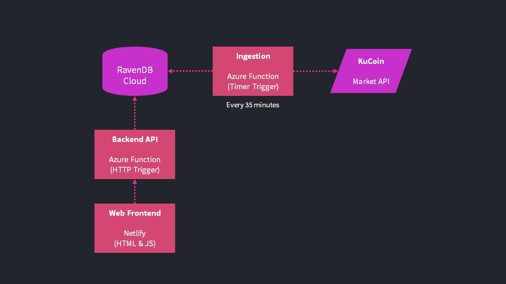

# RavenDB Crypto App Sample

An end-to-end sample application that showcases Time Series support in RavenDB through a crypto / stock chart inspired by [Robinhood](https://robinhood.com/us/en/) and powered by API data provided by [Kucoin](https://docs.kucoin.com/).

## Time Series Feature Showcase

You can watch a [quick 5 minute overview](https://www.youtube.com/watch?v=yF-ReWqVaqU) of the Time Series feature in RavenDB and what it enables.

There's also [an in-depth walkthrough](https://ravendb.net/articles/working-with-market-data-using-time-series-in-ravendb) of how this code was built that introduces you to the different parts of the Time Series API.

## Live Demo

https://crypto.samples.ravendb.net

## Database Exports

You can download sample exports of the RavenDB database [here](exports) that you can import into your own RavenDB instance locally or in [RavenDB Cloud](https://cloud.ravendb.net).

## Components

- **web** - A static HTML & TypeScript website front-end to display the crypto chart deployed through [AWS S3 Website Hosting](https://docs.aws.amazon.com/AmazonS3/latest/userguide/WebsiteHosting.html).
- **functions/ingestion-\*** - Node.js and .NET 5 C# [Azure functions](https://www.azure.com) that ingest BTC-USDT symbol data from Kucoin every 35 minutes.
- **functions/backend-\*** - Node.js and .NET 5 C# [Azure functions](https://www.azure.com) that host the HTTP endpoint to return aggregations and crypto symbol data.

The Azure Functions are implemented using both the .NET and Node.js SDKs for RavenDB to showcase working with Time Series APIs.

## Running Locally

See [CONTRIBUTING.md](CONTRIBUTING.md) for information on how to run the app locally or deploy it yourself.
